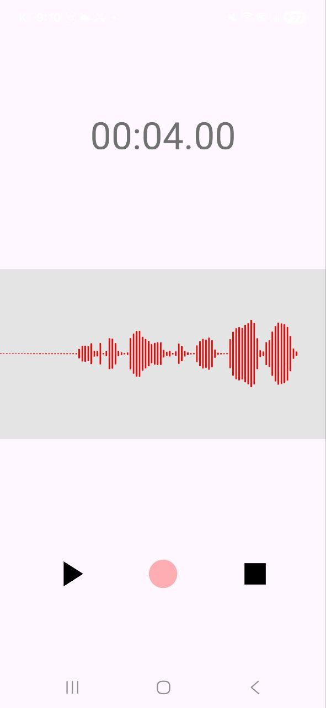
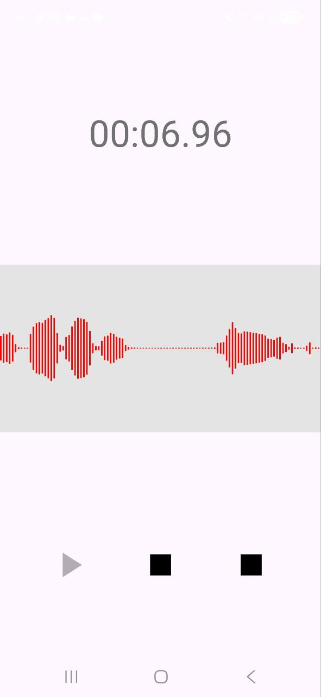

# 🎙️ Audio Recording App

A lightweight Android app built with **Kotlin** that lets users **record, play, and visualize audio** in real time using a custom waveform view.

---

## 🎥 Preview & Screenshot

<table align="center">
  <tr>
    <td align="center">
      
       📱 Recording Screen
    </td>
    <td align="center">
      
       📱 Playing Screen
    </td>
  </tr>
</table>

---

## 🧩 Key Features

- 🎙️ **Record audio** using `MediaRecorder`
- 🎧 **Play recordings** using `MediaPlayer`
- 📊 **Live waveform visualization** with custom `View`
- ⏱️ **Timer** updates every 40 ms for accurate duration tracking
- ⚙️ **Permission handling** with user-friendly dialogs
- 🧹 **Clean UI state** between record / play / stop

---

## ⚙️ Technologies Used

| Component | Purpose |
|------------|----------|
| **Kotlin** | Core language |
| **MediaRecorder / MediaPlayer** | Audio recording and playback |
| **Custom View (Canvas)** | Real-time waveform drawing |
| **Handler + Runnable** | Frame updates for waveform |
| **AlertDialog** | Permission guidance |
| **SharedPreferences** | Lightweight storage (if extended) |

---e

